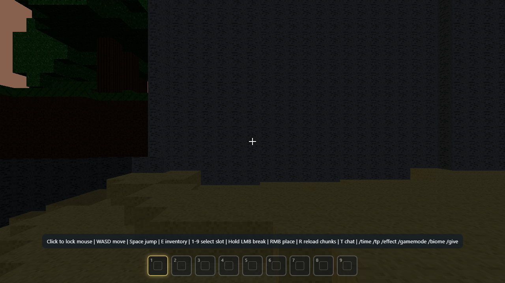
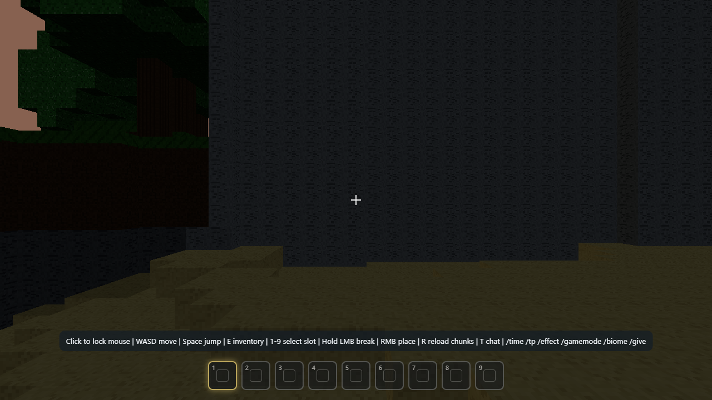
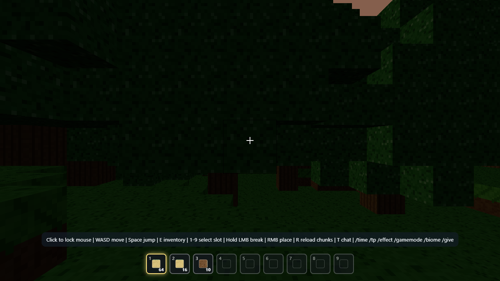

# Stonebound Realms

A voxel sandbox prototype inspired by classic block worlds. Procedural terrain, day/night cycle, lighting, inventory, and block interactions are all in place, with a clean ECS-style architecture and strict TypeScript.

## Screenshots

## Features

- Procedural terrain with biomes, caves, and trees.
- Greedy meshing for performant voxel rendering.
- Day/night cycle with sky lighting and block lighting.
- Survival + spectator gamemodes.
- Hotbar + inventory with stack sizes.
- Command system (`/time`, `/tp`, `/effect`, `/gamemode`, `/biome`, `/give`).

## Tech Stack

- TypeScript (strict mode)
- Vite
- Three.js
- ESLint + Prettier

## Getting Started

1. Install dependencies: `npm install`
2. Start dev server: `npm run dev`
3. Open the game: `http://localhost:5173/pages/game.html`

## Scripts

- `npm run dev`: Start Vite dev server.
- `npm run build`: Production build.
- `npm run preview`: Preview build output.
- `npm run typecheck`: TypeScript typecheck (`tsc --noEmit`).
- `npm run lint`: ESLint on source and tools.
- `npm run format`: Prettier write on common file types.
- `npm run format:check`: Prettier check for CI.

## Controls

- Click: lock mouse
- `WASD`: move
- `Space`: jump
- `Shift`: descend (spectator)
- `E`: inventory
- `1-9`: select hotbar slot
- Hold `LMB`: break block
- `RMB`: place block
- `R`: reload chunks
- `T`: chat

## Project Structure

- `client/src/core`: input, rendering setup, and shared engine utilities
- `client/src/ecs`: ECS components + world
- `client/src/game`: main game loop, systems wiring, and commands
- `client/src/systems`: gameplay systems (movement, chunk streaming, interactions, lighting)
- `client/src/world`: voxel world, storage, terrain, and meshing
- `client/src/ui`: HUD, hotbar, menus, chat, pause UI, and shared settings browser
- `client/pages`: HTML entry pages
- `client/styles`: page-level and shared stylesheets
- `tools`: test and automation scripts

## CI

GitHub Actions runs lint, typecheck, format checks, and build on every push and pull request.
